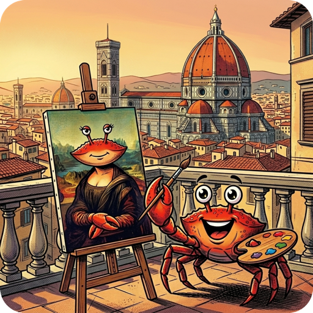

<p align="center">
    <a href="rusty-colorprofile.png"></a><br>
    <a href="https://crates.io/crates/rusty-colorprofile"></a>
    <a href="https://github.com/coderbants/rusty-colorprofile/actions"></a>
</p>

# Rusty Colorprofile (`rusty-colorprofile`)

**Rusty Colorprofile** is a complete, from-scratch Rust port of [colorprofile](https://github.com/charmbracelet/colorprofile), Charmbracelet's ANSI color-profile detection library — automatic downsampling of colors based on output, environment variables, and Terminfo databases. It tracks upstream on a rolling basis. **Version policy: the crate version and every release tag must equal the tracked upstream version exactly — never ahead, never behind** (enforced by `scripts/verify_upstream_version.sh` in CI and on every release). It shares the **1:1 parity** goals of the rest of the Rusty port family, favoring fidelity to upstream semantics over Rust-native rewrites.

It's part of the Rusty port family of the Bubble Tea ecosystem and builds on [rusty-x-ansi](https://github.com/coderbants/rusty-x-ansi) (ANSI primitives); it's used by [rusty-ultraviolet](https://github.com/coderbants/rusty-ultraviolet), [rusty-lipgloss](https://github.com/coderbants/rusty-lipgloss) and [rusty-bubbletea](https://github.com/coderbants/rusty-bubbletea).

Ported by hand from the upstream Go source (checked out in `upstream-go/`, gitignored);
see `UPSTREAM_MAPPING.md` for the full accounting. Verified byte-for-byte against the Go
library via the workspace parity harness (`/Users/jonny/Projects/rusty/tools/go-probes/`).

## Installation

```sh
cargo add rusty-colorprofile
```


## Usage

Detect the color profile for a terminal, then downsample colors to what it
supports:

```rust
use rusty_colorprofile::{detect, Profile};
use rusty_x_ansi::style::Color;
use rusty_x_ansi::color::RGBColor;
use std::io::IsTerminal;

// Detect the profile from whether we're attached to a TTY and the
// environment (COLORTERM, TERM, NO_COLOR, ...).
let env: Vec<String> = std::env::vars().map(|(k, v)| format!("{k}={v}")).collect();
let profile = detect(std::io::stdout().is_terminal(), &env);
println!("terminal color profile: {}", profile.string());

// Convert a TrueColor value to the closest color the profile supports.
let red = Color::RGB(RGBColor { r: 255, g: 0, b: 0 });
match profile.convert(red) {
    Some(c) => println!("renders as: {}", c.string()),
    None => println!("no color support"),
}
```

The profile is also used to render text: `new_writer(std::io::stdout(), &env)`
wraps an output stream and applies profile-aware color sequences as you write
styled text to it.
